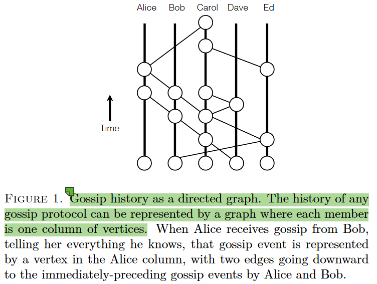
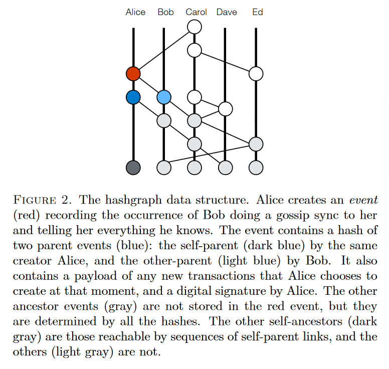
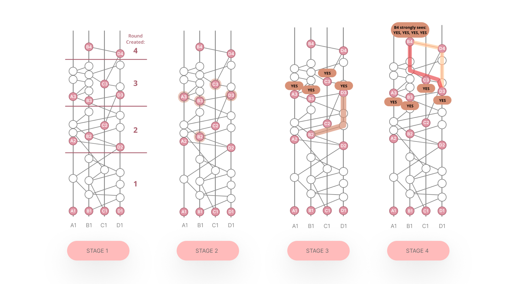
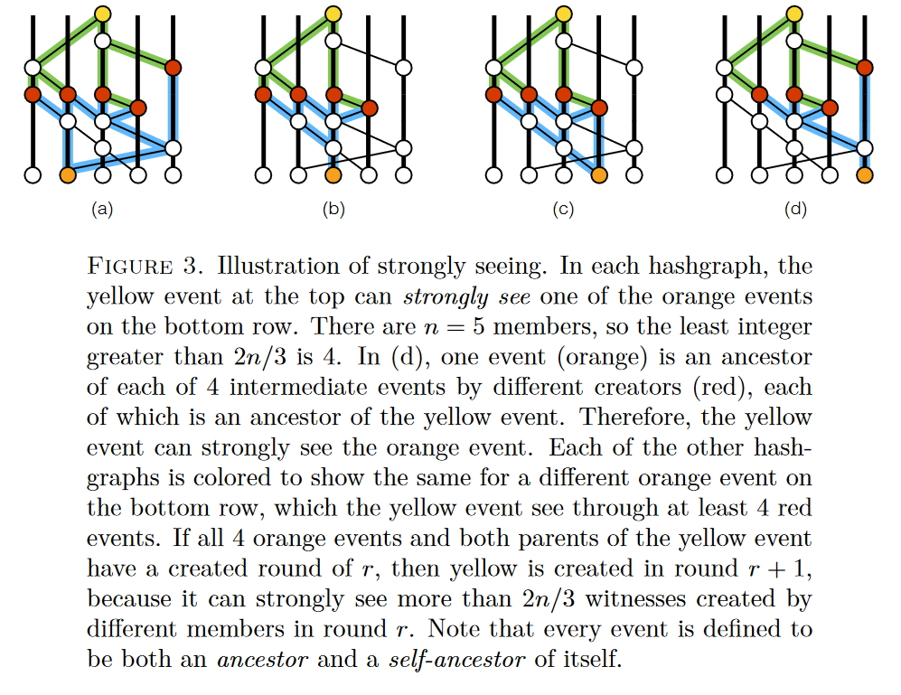

# Tóm tắt Hedera White Paper

## 1. Introduction

- Mục tiêu: Phân tích white paper và hashgraph của Hedera để cung cấp cái nhìn tổng quan về nền tảng blockchain này.
- Scope:
  - [HEDERA: A PUBLIC HASHGRAPH NETWORK & GOVERNING COUNCIL](https://hedera.com/hh-whitepaper)
  - [THE SWIRLDS HASHGRAPH CONSENSUS ALGORITHM: FAIR, FAST, BYZANTINE FAULT TOLERANCE](https://swirlds.com/downloads/SWIRLDS-TR-2016-01.pdf)

## 2. Overview of Hedera Blockchain

- Hedera là gì?

  - Hedera là một mạng blockchain công cộng nguồn mở, sử dụng thuật toán `hashgraph` để xác định thứ tự các giao dịch [[1](#1-what-is-hedera--hedera-2018-hedera-httpshederacomlearninghedera-hashgraphwhat-is-hedera-hashgraph)]. Hedera cung cấp chho các developers một nền tảng để xây dựng các ứng dụng phi tập trung, an toàn và hiệu quả, với 3 tính năng chính:
    - `Solidity-based Smart Contracts`: Hedera hỗ trợ việc viết các smart contracts bằng ngôn ngữ Solidity, giúp developers dễ dàng chuyển đổi các ứng dụng từ Ethereum sang Hedera.
    - `Consensus`: Hedera sử dụng thuật toán `hashgraph` để xác định thứ tự các giao dịch, giúp tăng tốc độ xác nhận giao dịch và giảm chi phí.
    - `Token services`: Hedera cung cấp các dịch vụ liên quan đến token, bao gồm tạo, phân phối và quản lý token.

- Consensus: Hedera sử dụng thuật toán `hashgraph` để xác định thứ tự các giao dịch. Thuật toán này giúp tăng tốc độ xác nhận giao dịch và giảm chi phí, tối ưu năng lượng tiêu thụ (carbon negative) và bảo mật.

_Hedera.com_

## 3. Introducing Hedera

> The Hedera network is a distributed ledger platform that resolves the factors that constrain adoption of public DLT by the mainstream.

Trong white paper của Hedera, họ giới thiệu những cải tiến sau:

1. Performance
   - Xây dựng dựa trên thuật toán hashgraph, phát minh bởi Dr.Leemon Baird.
   - Mang lại hiệu quả gần như hoàn hảo, khả năng xử lý giao dịch được dự đoán lên tới 10_000 TPS.
2. Security
   - Đạt "tiêu chuẩn vàng" về bảo mật trong lĩnh vực đồng thuận phân tán với: asynchronous Byzantine fault tolerance (aBFT) cho phép Hedera loại bỏ các nhân tố như coordinators, leaders, hoặc communication timeout để tăng hiệu suất, chống DDoS.
   - Đảm bảo tính công bằng trong thứ tự của các transaction gửi đến mạng.
3. Governance
   - Hedera sử dụng mô hình quản trị dựa trên `governing council` với 39 thành viên, mỗi thành viên có quyền bỏ phiếu về các quyết định quan trọng của mạng. (Thực tế hiện tại Hedera đang chạy với [32 nodes](https://hashscan.io/mainnet/nodes) thành viên)
   - Các node thành viên được chọn lọc từ nhiều lĩnh vực khác nhau như công nghệ, tài chính, chính phủ, v.v.
   - Mô hình này giúp Hedera tránh được các vấn đề về quyền lực và độc quyền, đồng thời giúp mạng trở nên bền vững và minh bạch hơn.
4. Stability
   - Công nghệ hashgraph đảm bảo phần mềm ở các client phải xác thực được cây phả hệ trước khi tham gia vào trạng thái chia sẻ thông tin. Tương tự như mọi mạng blockchain khác, phải tuân theo history của mạng để đảm bảo tính nhất quán.
   - Hashgraph cho phép hội đồng Hedera kiểm soát việc cập nhật phần mềm của mạng.
5. Regulatory compliance
   - Hedera technical framework cho khả năng thay đổi có kiểm soát trạng thái của mạng và khả năng bổ sung dữ liệu vào giao dịch, ví dụ như identity certificate

## 4. Hashgraph Consensus Algorithm

> Ta sẽ đi sâu vào paper của Hashgraph trong mục này

### I. Introduction

- Theo giả thuyết FLP [[2](#2-michael-j-fischer-nancy-a-lynch-and-michael-s-paterson-impossibility-of-distributed)], Baird chỉ ra hiện không có hệ thống Byzantine nào có thể hoàn toàn bất đồng bộ với độ trễ của các message mà vẫn đạt được sự đồng thuận.
- Thuật toán hashgraph đề xuất giải pháp cho vấn đề này, giúp mạng đạt được đồng thuận với xác suất bằng 1 (khả năng đạt được sự đồng thuận trong một hệ thống phân tán mà không có giới hạn về thời gian truyền thông điệp và vẫn đảm bảo đồng thuận, ngay cả khi có sự cố hoặc lỗi xảy ra) [[3](#3-randomizedconsensus-2014-yaleedu-httpswwwcsyaleeduhomesaspnespinewikirandomizedconsensushtml)].
- Thuật toán đồng thuận Hashgraph tương đương với một chuỗi block, trong đó mỗi "chuỗi" (chain) có thể tiếp tục phân nhánh mà không cần phải cắt tỉa (khác với Ethereum khi phải chọn một chuỗi con để tiếp tục), không có block nào bị loại bỏ và mỗi miner được phép khai thác nhiều block mới mỗi giây mà không cần đến PoW (proof-of-work), giúp mạng đạt 100% hiệu quả khi không cần cắt tỉa.
- Trong các hệ Byzantine, thường các message sẽ được trao đổi giữa các member để bầu chọn (vote). Với 1 hệ thống có $n$ thành viên, nếu ta cần quyết định cho một câu hỏi YES/NO, một số hệ thống cần tối thiểu $O(n)$ message trao đổi để đạt được đồng thuận, một số khác có thể lên tới $O(n^2)$, thậm chí là $O(n^3)$ để truyền thông tin trên toàn mạng. Hashgraph giải quyết vấn đề này bằng cách "vote ảo" mà không cần truyền thông tin trên toàn mạng.

### II. Core Concepts

Cốt lõi của Hashgraph Consensus bao gồm:

- **Transacions**: mọi thành viên có thể tạo một transaction được ký ở bất kỳ thời điểm nào, và mọi người đều có 1 bản sao của transaction đó. Sự đồng thuận đạt được khi mọi người đồng thuận với thứ tự của các transaction.
- **Fairness**: theo lý thuyết, rất khó để gây sự mất cân bằng trong việc xác định thứ tự của các transaction với những cuộc tấn công quy mô nhỏ
- **Gossip**: hashgraph lan truyền thông tin bằng cách "gossip" (tin đồn, đồn đại) với nhau, mỗi node chọn ngẫu nhiên một node khác để truyền thông tin mà nó đã biết.
- **Hashgraph**: một cấu trúc dữ liệu để ghi lại lịch sử một cách có thứ tự về việc ai đã "gossip" với ai.
- **Gossip about gossip**: hashgraph lan truyền thông tin về chính graph thông qua "gossip protocol". Thông tin được truyền đi không nhất thiết phải là transaction, mà chỉ là thông tin về việc ai đã "gossip" với ai. Dù vậy thì giao thức này sử dụng rất ít băng thông so với việc gossip về các transaction.
- **Virtual voting**: vì mọi thành viên đều có bản sao của hashgraph, nên thành viên Alice trong mạng có thể tính toán được phiếu bầu mà Bob sẽ gửi cho Alice. Nghĩa là Bob không thực sự cần phải thực hiện vote. Mọi thành viên có thể đạt được trạng thái đồng thuận mà không cần phải truyền thông tin về phiếu bầu của mình, khi đó, hashgraph đạt được sự hiệu quả khi không cần đến băng thông truyền tin, chỉ cần "gossip about gossip" là đủ.
- **Famous witnesses**: việc sắp xếp $n$ giao dịch theo thứ tự có thể thực hiện bằng cách chạy riêng biệt giao thức Byzantine với độ phức tạp $O(n\;log\;n)$ cho các câu hỏi yes/no về việc "có phải sự kiện $x$ đến trước sự kiện $y$ hay không?". Tuy nhiên Baird đề xuất một giải pháp nhanh hơn bằng cách chọn một vài sự kiện (các đỉnh trong đồ thị hashgraph), gọi là "witnesses" (nhân chứng), và một witness sẽ được coi là "famous" (nổi tiếng) nếu khi kiểm tra trên hashgraph cho thấy hầu hết mọi thành viên đã nhận được nó từ sớm sau khi khởi tạo. Khi đó, giao thức đồng thuận Byzantine trở nên hiệu quả chỉ với các witness, câu hỏi cần được trả lời lúc này sẽ trở thành "witness này có famous hay không?. Một khi mạng xác định được cùng một tập các famous witness, thứ tự các sự kiện sẽ được xác định một cách công bằng và chính xác từ hashgraph.
- **Strongly seeing**: cho 2 đỉnh bất kỳ $x$ và $y$ trong hashgraph, có thể tính toán ngay lập tức liệu $x$ có thể thấy (strongly see) $y$ hay bằng cách xấc định xem liệu chúng có được kết nối bằng các đường dẫn tới đủ thành viên trong mạng. Khái niệm này cho phép chứng minh một bổ đề rằng nếu Alice và Bob cùng tính toán virtual vote của Carol trên 1 câu hỏi cho trước, kết quả mà Alice và Bob nhận được sẽ giống nhau. Bổ đề này là một phần quan trọng để chứng minh về mặt toán học tính xác suất bằng 1 của đồng thuận Byzantine.

### III. Gossip about Gossip: The Hashgraph

- Thuật toán đồng thuận hashgraph sử dụng một giao thức gọi là "gossip protocol" (giao thức tin đồn). Các thành viên trong mạng sẽ trao đổi ngẫu nhiên với nhau về thông tin mà họ đã biết, và thông tin sẽ được lan truyền lặp lại tới khi mọi thành viên có cùng 1 hashgraph. Bằng cách này, nếu một thành viên nhận được một thông tin mới, anh ta sẽ lan truyền nó trong mạng một cách nhanh chóng theo cấp số nhân trong cộng đồng.

- Ta có thể biểu diễn lịch sử của một hashgraph bằng một đồ thị có hướng, với mỗi đỉnh là một sự kiện gossip.
  
  _Hình 1, Leemon Baird, 2016_

- Trong thuật toán đồng thuật, đồ thị được coi là một cấu trúc dữ liệu. Trong ví dụ hình 2 dưới đây, sự kiện màu đỏ có thể chứa thông tin về transaction bất kì mà Alice chọn để khởi tạo tại thời điểm đó, và kèm theo đó là timestamp mà Alice khởi tạo. Những đỉnh màu xám là những sự kiện không bao gồm trong đó mà được xác định bởi tập các hash về mặt mật mã học.
  
  _Hình 2, Leemon Baird, 2016_
- Cấu trúc dạng này cũng được đùng cho nhiều mục đích khác nhau, ví dụ như Git, khác đôi chút là Git không ghi lại các sự kiện về sự tương tác giữa các thành viên. Hashgraph từ đó được xây dựng cho một mục địch là lưu lại lịch sử tương tác của các thành viên trong mạng.
- Gossip protocol được sử dụng rộng rãi để truyền nhiều loại thông tin. Những loại thông tin đó có thể liên quan đến danh tính của user, hoặc những thông tin/tin đồn về các transaction, "gossip" về những khối blockchain hoặc bất kì thông tin nào mà một thành viên muốn chia sẻ với mọi người khác.
- Lan truyền một hashgraph mang lại lợi ích về thông tin rất lớn. Nếu một transaction mới được đặt trong payload của một sự kiện, nó sẽ nhanh chóng lan truyền tới tất cả các thành viên, cho tới khi toàn mạng biết về sự kiện đó.
- Dù tất cả mọi người đều có bản copy về hashgraph của mạng. Khi mạng càng phất triển, đôi khi các thành viên có thể có những tập sự kiện khác nhau ở gần đỉnh của đồ thị, nhưng chúng sẽ nhanh chóng hội tụ để thống nhất về một hashgraph duy nhất với chung lịch sử.
- Thêm một điểm nữa, nếu Alice và Bob có cùng 1 sự kiện trong hashgraph, có thể đảm bảo rằng cả 2 đều sở hữu chung những sự kiện trước đó, và họ đều thống nhất về tất cả các cạnh, đỉnh trong đồ thị con của hashgraph mà họ đang sở hữu. Tất cả điều này cho phép thuật toán đồng thuận hoàn toàn có thể chạy cục bộ, bao gồm cả khả năng chịu lỗi Byzantine.
- Trong hình 2, Alice sẽ không gửi sự kiện màu đỏ cho tới khi Carol đã có tất cả những sự kiện tổ tiên của nó (cho dù trước đó Carol đã đồng bộ thông tin với thành viên khác). Vậy nên Alice không cần phải gửi hash của 2 sự kiện màu xanh trước đó, chỉ cần báo với Carol rằng sự kiện được gửi đến chính là sự kiện tiếp theo của Alice và sự kiên cha (màu xanh) chính là sự kiện thứ 3 của Bob. Với kỹ thuật nén thích hợp, thông tin này được gửi đi chỉ với vài byte, chỉ làm tăng một vài % của kích thước tin nhắn được gửi đi.

### IV. Consensus Algorithm

Nhưng như vậy vẫn chưa thể đảm bảo mọi thành viên sẽ biết về mọi sự kiện trong mạng. Mạng cần phải thống nhất về thứ tự tuyến tính của các sự kiện và đồng thời là những giao dịch được ghi bên trong sự kiện đó.

- Như đã đề cập trước đó, đồng thuận bằng hashgraph không yêu cầu bất kỳ phiếu bầu nào phải gửi lên mạng. Mọi thành viên có thể tính toán được phiếu bầu khi họ dùng chung một thuật toán và thông tin, các kết quả cuối cùng sẽ giống nhau. Tuy nhiên cũng như đã nói, có thể xảy ra việc Alice và Bob có thể không có cùng hashgraph tại một thời điểm cụ thể, có thể họ có chung lịch sử sự kiện nhưng không phải những sự kiện gần đây nhất. Hơn nữa, có thể xuất hiện một sự kiện được khởi phát từ một thành viên trong mạng nhưng đến chậm hơn và vì đó nó có vị trí thấp hơn trong đồ thị hashgraph.
- Để giải quyết nó, Baird đề xuất sử dụng dụng một hệ thống "bỏ phiếu giả" (virtual voting).

Giả sử Alice có hashgraph $A$, Bob có hashgraph $B$. Những đồ thị này có thể có đôi chút khác biệt tại một thời điểm nhất định, nhưng cuối cùng tất cả sẽ luôn luôn hội tụ và nhất quán. Sự nhất quán ở đây nghĩa là nếu $A$ và $B$ đều chứa một sự kiện $x$ và $y$, thì $x$ và $y$ sẽ được sắp xếp theo cùng một thứ tự trong cả 2 hashgraph. Điều này giúp mạng đạt được sự đồng thuận về thứ tự của các sự kiện.

Nếu Alice biết về sự kiện $x$ nhưng Bob thì không, giả định cả 2 đều trung thực và tích cực tương tác, thì Bob sẽ sớm nhận được thông tin về sự kiện đó một cách chính xác và nhanh chóng thông qua gossip protocol.
Thuật toán đồng thuận của Baird giả định rằng điều đó sẽ xảy ra, nhưng không đưa ra dự đoán nào về tốc độ của nó. Giao thức của ông hoàn toàn bất đồng bộ, và không giả định về khoảng thời gian chờ của các sự kiện, tốc độ lan truyền thông tin hay thời gian thực hiện tiến trình.

Alice sẽ tính toán thứ tự của tất cả các sự kiện trong $A$ bằng một chuỗi các cuộc bầu chọn (elections). Trong mỗi lần bầu chọn, một số sự kiện trong $A$ được coi là bỏ phiếu, và một số được coi là nhận được những biếu bầu đó. Qua nhiều cuộc bỏ phiếu như vậy, một số sự kiện có thể năm trong một số cuộ bỏ phiếu nhưng không phải tất cả. Ví dụ như nếu sự kiện được tạo ra bởi Bob, nghĩa là Bob đã thực hiện bỏ phiếu trong 1 cuộc bầu chọn. Những sự kiện này có thể tính toán hoàn toàn cục bộ, Alice có thể tính số phiếu bầu mà Bob có thể sẽ gửi cho cô ấy, và ngược lại.

Về tổng thể, virtual voting giúp đạt được hiệu suất về băng thông và sự độc lập trong tính toán, ngoài ra nó còn đảm bảo các thành viên trong mạng luôn tính toán các lượt vote theo đúng quy định. Giả sử Alice là thành thật, những tính toán của Alice về lượt vote của Bob sẽ là trung thực, khi đó cho dù "real Bob" gian lận thì cũng không thể ảnh hưởng đến kết quả tính toán của Alice với "virtual Bob".

_Virtual voting, Rahul, accubits.com_

Lúc này, Bob nghĩ ra một cách cheat khác. Bob tạo 1 sự kiện $x$ với hash sự kiện cha của nó trỏ đến sự kiện $z$ cũng của Bob tạo ra. Sau đó anah ta tiếp tục tạo sự kiện $y$ cũng chọn $z$ là sự kiện cha thay vì $x$. Hashgraph của Bob lúc này sẽ trở thành 1 tree mà không còn là 1 chain nữa vì xuất hiện nhánh $y$ và $x$ đều mọc từ $z$. Nếu Bob truyền thông tin về $x$ cho Alice, $y$ cho Carol, cả 2 có thể sẽ không nhận ra sự phân nhánh trong một khoảng thời gian nhất định và dẫn đến tính toán hashgraph khác nhau.

Hashgraph sử dụng kỹ thuật gọi là "seeing" và "strongly seeing" để giải quyết vấn đề này. Kỹ thuật này dựa trên định nghĩa về "ancestor" và "self-ancestor" của một sự kiện sao cho một sự kiện được coi đồng thời là ancestor và self-ancestor của chính nó.

Để tránh việc bị các nhánh mà cheater "fork" ra làm phân tán sự đồng thuận, khi có $n$ thành viên và một sự kiện $w$ "strongly see" sự kiện $x$, nếu $w$ được thấy (nằm trong hashgraph chain) trong nhiều hơn $2n/3$ sự kiện bởi cách thành viên khác nhau, mỗi sự kiện đều sẽ thấy được $x$.

_Hình 3, Leemon Baird, 2016_

Thiết kế này cho phép giao thức đồng thuận có thể đạt đưuọc BFT mà không cần thực sự phải vote mà chỉ cần virtual voting. Giả sử sự kiện $x$ và $y$ ở những nhánh được cheater tạo ra, nếu hashgraph $A$ và $B$ đồng nhất, thì không thể tồn tại một sự kiện $x$ "strongly see" trong $A$ và một sự kiện $y$ "strongly see" trong B. Bổ đề này đảm bảo rằng dù cheater cố gắng fork thì cũng không thể khiến các thành viên trong mạng đưa ra các quyết định khác nhau được.

Về chi tiết các thuật toán được định nghĩa, bạn có thể đọc thêm trong paper gốc của tác giả

### V. Generalizations and enhancements

Ta điểm lại một số ý tổng quan và cải tiến với hashgraph

#### 1. proof-of-stake

- Với mọi thành viên là ngang hàng, thuật toán hashgraph đòi hỏi một quyết định phải phụ thuộc vào "nhiều hơn $2n/3$ tổng số thành viên" và "ít nhất một nửa các sự kiện nhân chứng nổi tiếng (famous witness events)". Đồng thời cũng sử dụng ý tưởng về "trung vị" của tập hợp số (thời gian của sự kiện được lấy là trung vị thời gian nhận của tất cả các node). Những điều này chứng minh sự hội tụ Byzantine khi có hơn $2n/3$ thành viên là trung thực.

#### 2. signed state

- Một cải tiến khác là signed states. Khi đã đạt được đồng thuận về các nhân chứng nổi tiếng trong vòng bầu chọn $r$, tổng thứ tự có thể được tính cho mọi sự kiện trong lịch sử từ round $r$ trở xuống. Nó cũng đảm bảo mọi sự kiện khác (kể cả chưa biết) sẽ nằm ở round có số thứ tự lớn hơn $r$. Nói cách khác, ở thời điểm này, lịch sử sự kiện bị đóng băng và không thể sửa đổi với mọi sự kiện trước round $r$.

#### 3. Efficient gossip

- Gossip protocoll được chứng minh là có độ hiệu quả về băng thông. Giẩ sự ta có dủ số transaction được tạo để mỗi sự kiện chứa ít nhất 1 transaction. Trong bất kỳ máy trạng thái nhân bản nào, sử dụng mạng điểm-điểm như internet, việc cần thiết là mỗi thành viên nhận mỗi giao dịch đã ký một lần và cũng gửi mỗi giao dịch đã ký trung bình một lần.

#### 4. Fast elections

- Khi tất cả thành viên trong nhóm online và tương tác, độ nổi tiếng của nhân chứng sẽ luôn được quyết định ngay lập tức mà không cần nhiều round bình chọn.

#### 5. Efficient caculations

- Các phép tính và so sánh mảng có thể được thực hiện bằng mutithreading, sử dụng ALU, assembly language, hoặc GPU (tính toán song song với vector)

## 5. Conclusions

Kiến trúc và thuật toán đồng thuận hashgraph của Swirlds đạt được những tiêu chí phù hợp cho một mạng blockchain. Với gossip protocol, hashgraph, virtual voting,... đã chứng minh được tính công bằng, hiệu suất và khả năng đạt được trạng thái BFT. Hashgraph cũng như Hedera blockchain hứa hẹn đem lại tính minh bạch và mở cửa cho cộng đồng phát triển.

## 6. References

#### [1] What is Hedera? | Hedera. (2018). Hedera. https://hedera.com/learning/hedera-hashgraph/what-is-hedera-hashgraph

#### [2] Michael J. Fischer, Nancy A. Lynch, and Michael S. Paterson. Impossibility of distributed

#### [3] RandomizedConsensus. (2014). Yale.edu. https://www.cs.yale.edu/homes/aspnes/pinewiki/RandomizedConsensus.html

‌

‌
