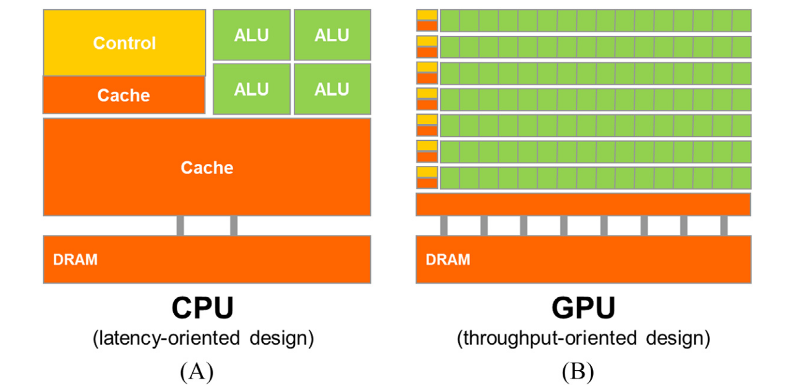

# 1. Tính toán song song không đồng nhất

Từ thời buổi đầu của máy tính, nhiều ứng dụng quan trọng đã yêu cầu nhiều tốc dộ thự thi và tài nguyên hơn những gì mà các thiết bị máy tính có thể cung cấp. Các ứng dụng ban đầu dựa vào sự tiến bộ của tốc độ bộ xử lý, tốc dộ bộ nhớ và dung lượng bộ nhớ để nâng cao khả năng ở cấp độ ứng dụng như tính kịp thời của dự báo thời tiết, độ chính xác của phân tích cấu trúc kỹ thuật, tính chân thực của đồ họa do máy tính tạo ra, số lượng đặt chỗ hàng không được xử lý mỗi giây hay số lượng chuyển tiền được xử lý mỗi giây. Những ứng dụng đó đã túc đẩy sự tiên bộ nhnah chóng về khả năng của thiết bị điện toán trong năm thập kỷ qua và sẽ còn tiếp tục như vậy trong tương lai.

Vi xử lý dựa trên một đơn vị xử lý trung tâm (CPU) duy nhất, có vẻ như thực thi các hướng dẫn theo các bước tuần tự, chẳng hạn như những vi xử lý 386 của Intel và AMD, được trang bị tần số xung nhịp và tài nguyên phần cứng ngày càng tăng nhanh, đã thúc đẩy sự gia tăng hiệu năng và giảm chi phí nhanh chóng trong các ứng dụng máy tính trong những năm 1980 và 1990. Trong hai thập kỷ tăng trưởng, các vi xử lý đơn CPU này đã mang lại GFLOPS, hay giga (109) phép toán dấu phẩy động mỗi giây, lên máy tính để bàn và TFLOPS, hay tera (1012) phép toán dấu phẩy động mỗi giây, đến các trung tâm dữ liệu. Sự thúc đẩy không ngừng nhằm cải thiện hiệu năng này đã cho phép phần mềm ứng dụng cung cấp nhiều chức năng hơn, có giao diện người dùng tốt hơn và tạo ra kết quả hữu ích hơn. Đổi lại, người dùng lại đòi hỏi nhiều cải tiến hơn nữa khi họ đã quen với những cải tiến này, tạo ra một vòng tuần hoàn tích cực (đức hạnh) cho ngành công nghiệp máy tính.

Tuy nhiên, đà phát triển này đã chậm lại kể từ năm 2003, do các vấn đề tiêu thụ năng lượng và tản nhiệt. Những vấn đề này hạn chế việc tăng tần số xung nhịp và các hoạt động hiệu quả có thể được thực hiện trong mỗi chu kỳ xung nhịp bên trong một CPU đơn, trong khi vẫn duy trì vẻ ngoài của việc thực thi các lệnh theo từng bước tuần tự. Kể từ đó, hầu hết tất cả các nhà cung cấp vi xử lý đã chuyển sang mô hình sử dụng nhiều CPU vật lý, được gọi là các lõi xử lý, trong mỗi con chip để tăng sức mạnh xử lý. Một CPU truyền thống có thể được xem là một CPU đơn nhân trong mô hình này. Để hưởng lợi từ nhiều lõi xử lý, người dùng phải có nhiều chuỗi lệnh, dù từ cùng một ứng dụng hay các ứng dụng khác nhau, có thể đồng thời thực thi trên các lõi xử lý này. Để một ứng dụng cụ thể hưởng lợi từ nhiều lõi xử lý, công việc của nó phải được chia thành nhiều chuỗi lệnh có thể đồng thời thực thi trên các lõi xử lý này. Sự chuyển đổi từ một CPU đơn thực thi các lệnh theo từng bước tuần tự sang nhiều lõi thực thi nhiều chuỗi lệnh song song đã tạo ra một tác động to lớn đến cộng đồng nhà phát triển phần mềm.

Theo truyền thống, phần lớn các ứng dụng phần mềm được viết dưới dạng các chương trình tuần tự được thực thi bởi các bộ xử lý có thiết kế được von Neumann hình dung trong báo cáo mang tính bước ngoặt của ông năm 1945 (von Neumann và cộng sự, 1972). Quá trình thực thi các chương trình này có thể được con người hiểu là tuần tự bước qua mã dựa trên khái niệm bộ đếm chương trình, còn được gọi là con trỏ lệnh trong tài liệu. Bộ đếm chương trình chứa địa chỉ bộ nhớ của lệnh tiếp theo sẽ được bộ xử lý thực thi. Chuỗi các hoạt động thực thi lệnh dẫn đến việc thực thi tuần tự, từng bước một của ứng dụng được gọi là luồng thực thi, hoặc đơn giản là luồng, trong tài liệu. Khái niệm luồng rất quan trọng đến nỗi nó sẽ được định nghĩa chính thức hơn và được sử dụng rộng rãi trong phần còn lại của cuốn sách này.

Trên thực tế, hầu hết các nhà phát triển phần mềm trước đây đều dựa vào những tiến bộ của phần cứng, chẳng hạn như tốc độ xung nhịp tăng lên và việc thực thi nhiều lệnh ngầm, để tăng tốc độ các ứng dụng tuần tự của họ; cùng một phần mềm đơn giản là chạy nhanh hơn khi mỗi thế hệ bộ xử lý mới được giới thiệu. Người dùng máy tính cũng dần quen với việc các chương trình này chạy nhanh hơn với mỗi thế hệ vi xử lý mới. Kỳ vọng này đã không còn chính xác trong hơn một thập kỷ. Một chương trình tuần tự chỉ chạy trên một trong các lõi xử lý, và tốc độ của nó sẽ không tăng đáng kể từ thế hệ này sang thế hệ khác. Không có sự cải thiện về hiệu năng, các nhà phát triển ứng dụng sẽ không còn có thể giới thiệu các tính năng và khả năng mới vào phần mềm của họ khi các vi xử lý mới được ra mắt; điều này làm giảm cơ hội phát triển của toàn bộ ngành công nghiệp máy tính.

Thay vào đó, phần mềm ứng dụng sẽ tiếp tục được cải thiện hiệu năng đáng kể với mỗi thế hệ vi xử lý mới là các chương trình song song, trong đó nhiều luồng thực thi hợp tác để hoàn thành công việc nhanh hơn. Ưu thế mới, được nâng cao đáng kể này của các chương trình song song so với các chương trình tuần tự đã được gọi là cuộc cách mạng song song ([Sutter và Larus, 2005](#sutter-h-larus-j-2005-software-and-the-concurrency-revolution-in-acm-queue-3-7-54-62)). Việc thực hành lập trình song song không phải là mới. Cộng đồng điện toán hiệu năng cao (HPC) đã phát triển các chương trình song song trong nhiều thập kỷ. Những chương trình song song này thường chạy trên các máy tính quy mô lớn đắt tiền. Chỉ một số ít ứng dụng ưu tú mới có thể biện minh cho việc sử dụng các máy tính này, do đó hạn chế việc thực hành lập trình song song đối với một số lượng nhỏ các nhà phát triển ứng dụng. Giờ đây, tất cả các vi xử lý mới đều là máy tính song song, số lượng ứng dụng cần được phát triển thành các chương trình song song đã tăng lên đáng kể. Hiện nay có một nhu cầu lớn đối với các nhà phát triển phần mềm để tìm hiểu về lập trình song song, đó là trọng tâm của cuốn sách này.

## 1. Tính toán song song không đồng nhất

Từ năm 2003, ngành công nghiệp bán dẫn đã định hình hai hướng chính trong thiết kế vi xử lý (Hwu và cộng sự, 2008). Hướng đa lõi nhằm duy trì tốc độ thực thi của các chương trình tuần tự trong khi chuyển sang nhiều lõi. Các vi xử lý đa lõi bắt đầu với bộ xử lý hai lõi, và số lượng lõi đã tăng lên với mỗi thế hệ công nghệ bán dẫn. Một ví dụ gần đây là vi xử lý máy chủ đa lõi Intel với tối đa 24 lõi xử lý, mỗi lõi là một bộ xử lý phát hành nhiều lệnh không theo thứ tự, thực hiện đầy đủ bộ lệnh X86, hỗ trợ siêu luồng với hai luồng phần cứng, được thiết kế để tối đa hóa tốc độ thực thi của các chương trình tuần tự. Một ví dụ khác là vi xử lý máy chủ đa lõi ARM Ampere với 128 lõi xử lý.

Ngược lại, quỹ đạo đa luồng tập trung nhiều hơn vào năng suất thực thi của các ứng dụng song song. Quỹ đạo đa luồng bắt đầu với một số lượng lớn luồng, và một lần nữa, số lượng luồng tăng lên với mỗi thế hệ. Một ví dụ gần đây là đơn vị xử lý đồ họa (GPU) NVIDIA Tesla A100 với hàng chục nghìn luồng, thực thi trong một số lượng lớn các đường ống đơn giản, theo thứ tự. Các bộ xử lý đa luồng, đặc biệt là GPU, đã dẫn đầu cuộc đua về hiệu năng số chấm động kể từ năm 2003. Tính đến năm 2021, năng suất số chấm động đỉnh điểm của GPU A100 là 9,7 TFLOPS cho độ chính xác kép (double-precision) 64 bit, 156 TFLOPS cho độ chính xác đơn (single-precision) 32 bit và 312 TFLOPS cho độ chính xác bán phần (half-precision) 16 bit. Để so sánh, năng suất số chấm động đỉnh điểm của bộ xử lý 24 nhân Intel gần đây là 0,33 TLOPS cho độ chính xác kép và 0,66 TFLOPS cho độ chính xác đơn. Tỷ lệ năng suất tính toán số chấm động đỉnh điểm giữa GPU đa luồng và CPU đa nhân đã tăng lên trong vài năm qua. Đây không nhất thiết là tốc độ ứng dụng; chúng chỉ đơn thuần là tốc độ thô mà các tài nguyên thực thi có thể hỗ trợ tiềm năng trong các chip này.

Khoảng cách hiệu năng đỉnh điểm lớn như vậy giữa đa lõi và đa luồng đã dẫn đến sự tích tụ “điện thế” đáng kể, và ở một thời điểm nào đó, điều gì đó sẽ phải thay đổi. Chúng ta đã đến thời điểm đó. Cho đến nay, khoảng cách hiệu năng đỉnh điểm lớn này đã thúc đẩy nhiều nhà phát triển ứng dụng chuyển các phần tính toán chuyên sâu của phần mềm sang GPU để thực thi. Có lẽ còn quan trọng hơn, hiệu năng được nâng cao đáng kể của việc thực thi song song đã tạo ra các ứng dụng mới mang tính cách mạng như học sâu vốn có bản chất được cấu tạo từ các phần tính toán chuyên sâu. Không có gì đáng ngạc nhiên khi các phần tính toán chuyên sâu này cũng là mục tiêu chính của lập trình song song: Khi có nhiều công việc hơn cần làm, sẽ có nhiều cơ hội hơn để chia nhỏ công việc giữa các tiến trình song song hợp tác, tức là các luồng.

Người ta có thể đặt câu hỏi tại sao lại có khoảng cách hiệu năng đỉnh điểm lớn như vậy giữa GPU đa luồng và CPU đa nhân. Câu trả lời nằm ở sự khác biệt trong triết lý thiết kế cơ bản giữa hai loại bộ xử lý này, như được minh họa trong Hình 1.1. Thiết kế của một CPU, như thể hiện trong Hình 1.1A, được tối ưu hóa cho hiệu năng mã tuần tự. Các đơn vị số học và logic phân phối dữ liệu toán hạng được thiết kế để giảm thiểu độ trễ hiệu quả của các phép toán số học với chi phí tăng sử dụng diện tích chip và công suất trên mỗi đơn vị. Bộ nhớ cache cấp-cuối (last-level) lớn trên chip được thiết kế để lưu trữ dữ liệu được truy cập thường xuyên và chuyển đổi một số truy cập bộ nhớ độ trễ dài thành truy cập cache độ trễ ngắn. Logic dự đoán nhánh và logic điều khiển thực thi tinh vi được sử dụng để giảm thiểu độ trễ của các lệnh nhánh có điều kiện. Bằng cách giảm độ trễ của các phép toán, phần cứng CPU làm giảm độ trễ thực thi của mỗi luồng riêng lẻ. Tuy nhiên, các đơn vị số học độ trễ thấp, logic phân phối toán hạng tinh vi, bộ nhớ cache lớn và logic điều khiển tiêu thụ diện tích chip và công suất, nếu không có thể được sử dụng để cung cấp thêm các đơn vị thực thi số học và kênh truy cập bộ nhớ. Phương pháp thiết kế này thường được gọi là thiết kế định hướng độ trễ.

Mặt khác, triết lý thiết kế của GPU được định hình bởi ngành công nghiệp trò chơi điện tử phát triển nhanh chóng, nơi tạo ra áp lực kinh tế khổng lồ để có khả năng thực hiện một lượng lớn phép tính số thực và truy cập bộ nhớ trên mỗi khung hình video trong các trò chơi tiên tiến. Nhu cầu này thúc đẩy các nhà cung cấp GPU tìm kiếm cách tối đa hóa diện tích chip và ngân sách năng lượng dành cho phép tính số thực và thông lượng truy cập bộ nhớ.

<figure>
    
    <figcaption>Hình 1.1 CPU và GPU có triết lý thiết kế cơ bản khác nhau: (A) Thiết kế CPU hướng đến độ trễ; (B) Thiết kế GPU hướng đến thông lượng.
</figcaption>
</figure>

Sự cần thiết phải thực hiện một lượng lớn phép tính dấu phẩy động mỗi giây trong các ứng dụng đồ họa cho các tác vụ như biến đổi điểm nhìn và kết xuất đối tượng là khá trực quan. Thêm vào đó, sự cần thiết phải thực hiện một lượng lớn truy cập bộ nhớ mỗi giây cũng quan trọng không kém, và có lẽ còn quan trọng hơn. Tốc độ của nhiều ứng dụng đồ họa bị giới hạn bởi tốc độ mà dữ liệu có thể được chuyển từ hệ thống bộ nhớ vào bộ xử lý và ngược lại. Một GPU phải có khả năng di chuyển một lượng dữ liệu cực lớn vào và ra khỏi bộ đệm khung hình đồ họa trong DRAM (bộ nhớ truy cập ngẫu nhiên động) của nó bởi vì việc di chuyển đó là yếu tố làm cho màn hình video trở nên phong phú và làm hài lòng người chơi. Mô hình bộ nhớ thả lỏng (relax memory model - cách mà nhiều phần mềm hệ thống, ứng dụng và thiết bị I/O mong đợi các truy cập bộ nhớ của chúng hoạt động) được các ứng dụng trò chơi chấp nhận phổ biến cũng giúp GPU dễ dàng hỗ trợ song song khổng lồ trong việc truy cập bộ nhớ.

Ngược lại, các bộ xử lý đa dụng phải đáp ứng các yêu cầu từ các hệ điều hành, ứng dụng và thiết bị I/O cũ, điều này gây ra nhiều thách thức hơn trong việc hỗ trợ truy cập bộ nhớ song song và do đó làm khó khăn hơn trong việc tăng tốc độ xử lý truy cập bộ nhớ, thường được gọi là băng thông bộ nhớ. Kết quả là, các chip đồ họa đã hoạt động ở băng thông bộ nhớ cao gấp khoảng 10 lần so với các chip CPU có sẵn cùng thời điểm, và chúng tôi dự đoán rằng GPU sẽ tiếp tục có lợi thế về băng thông bộ nhớ trong một thời gian nữa.

Một quan sát quan trọng là việc giảm độ trễ tốn kém hơn nhiều so với việc tăng thông lượng về mặt điện năng và diện tích chip. Ví dụ, người ta có thể tăng gấp đôi thông lượng phép tính bằng cách nhân đôi số lượng đơn vị phép tính với chi phí nhân đôi diện tích chip và mức tiêu thụ điện năng. Tuy nhiên, việc giảm một nửa độ trễ phép tính có thể yêu cầu tăng gấp đôi dòng điện với chi phí lớn hơn gấp đôi diện tích chip được sử dụng và tăng gấp bốn lần mức tiêu thụ điện năng. Do đó, giải pháp phổ biến trong GPU là tối ưu hóa cho thông lượng thực thi của một lượng lớn luồng chứ không phải giảm độ trễ của từng luồng. Phương pháp thiết kế này tiết kiệm diện tích chip và năng lượng bằng cách cho phép các kênh bộ nhớ và các phép toán được xử lý tuần tự có độ trễ dài. Việc giảm diện tích và năng lượng của phần cứng truy cập bộ nhớ và các đơn vị phép tính cho phép các nhà thiết kế GPU có nhiều hơn trên một chip và do đó tăng tổng thông lượng thực thi. Hình 1.1 minh họa trực quan sự khác biệt trong các phương pháp thiết kế bằng cách hiển thị một số lượng nhỏ các đơn vị phép tính lớn hơn và một số lượng nhỏ các kênh bộ nhớ trong thiết kế CPU ở Hình 1.1A, trái ngược với số lượng lớn các đơn vị phép tính nhỏ hơn và một số lượng lớn các kênh bộ nhớ trong Hình 1.1B.

Phần mềm ứng dụng cho các GPU này dự kiến sẽ được viết với một lượng lớn luồng song song. Phần cứng tận dụng số lượng lớn luồng để tìm việc cần làm khi một số luồng đang chờ truy cập bộ nhớ hoặc các phép toán có độ trễ cao. Các bộ nhớ cache nhỏ trong Hình 1.1B được cung cấp để giúp kiểm soát các yêu cầu băng thông của các ứng dụng này sao cho nhiều luồng truy cập cùng một dữ liệu bộ nhớ không cần phải cùng truy cập vào DRAM. Kiểu thiết kế này thường được gọi là thiết kế hướng hiệu suất, vì nó cố gắng tối đa hóa tổng hiệu suất thực thi của một lượng lớn luồng trong khi cho phép các luồng riêng lẻ mất nhiều thời gian hơn để thực thi.

Điều rõ ràng là GPU được thiết kế như những bộ máy tính song song, định hướng hiệu suất xử lý, và chúng sẽ không hoạt động tốt với một số tác vụ mà CPU được thiết kế để thực hiện tốt. Đối với các chương trình chỉ có một hoặc rất ít luồng, CPU với độ trễ hoạt động thấp hơn có thể đạt được hiệu năng cao hơn nhiều so với GPU. Khi một chương trình có số lượng luồng lớn, GPU với hiệu suất xử lý cao hơn có thể đạt được hiệu năng cao hơn nhiều so với CPU. Do đó, người ta nên dự đoán rằng nhiều ứng dụng sử dụng cả CPU và GPU, thực hiện các phần tuần tự trên CPU và các phần tính toán chuyên sâu trên GPU. Đây là lý do tại sao mô hình lập trình Compute Unified Device Architecture (CUDA), được NVIDIA giới thiệu vào năm 2007, được thiết kế để hỗ trợ việc thực thi ứng dụng kết hợp CPU-GPU.

Điều quan trọng cần lưu ý là tốc độ không phải là yếu tố quyết định duy nhất khi các nhà phát triển ứng dụng lựa chọn bộ xử lý để chạy ứng dụng của họ. Một số yếu tố khác thậm chí còn quan trọng hơn. Trước hết, bộ xử lý được lựa chọn phải có mặt rất rộng rãi trên thị trường, được gọi là lượng máy đã cài đặt bộ xử lý đó. Lý do rất đơn giản. Chi phí phát triển phần mềm được biện minh tốt nhất bằng một lượng khách hàng rất lớn. Các ứng dụng chạy trên bộ xử lý có thị phần nhỏ sẽ không có lượng khách hàng lớn. Đây là một vấn đề lớn đối với các hệ thống tính toán song song truyền thống có thị phần không đáng kể so với vi xử lý đa dụng. Chỉ một số ít ứng dụng ưu tú được chính phủ và các tập đoàn lớn tài trợ mới được phát triển thành công trên các hệ thống tính toán song song truyền thống này. Điều này đã thay đổi với các GPU đa luồng. Do sự phổ biến của chúng trên thị trường PC, GPU đã được bán với số lượng hàng trăm triệu chiếc. Hầu hết tất cả các máy tính để bàn và máy tính xách tay cao cấp đều có GPU. Hiện nay có hơn 1 tỷ GPU hỗ trợ CUDA đang được sử dụng. Thị phần lớn như vậy đã khiến các GPU này trở thành mục tiêu hấp dẫn về mặt kinh tế đối với các nhà phát triển ứng dụng.

Một yếu tố quyết định quan trọng khác là các yếu tố hình thức thực tiễn và khả năng truy cập dễ dàng. Cho đến năm 2006, các ứng dụng phần mềm song song chạy trên máy chủ trung tâm dữ liệu hoặc cụm máy tính của bộ phận. Nhưng các môi trường thực thi như vậy có xu hướng hạn chế việc sử dụng các ứng dụng này. Ví dụ, trong một ứng dụng như hình ảnh y tế, việc công bố một bài báo dựa một cụm máy 64 node là ổn. Nhưng các ứng dụng lâm sàng thực tế trên máy Chụp cộng hưởng từ (MRI) đã dựa trên sự kết hợp giữa máy tính cá nhân và bộ tăng tốc phần cứng đặc biệt. Lý do đơn giản là các nhà sản xuất như GE và Siemens không thể bán máy MRI đòi hỏi các giá máy chủ máy tính trong môi trường lâm sàng, trong khi điều này là phổ biến trong các môi trường bộ phận học thuật. Trên thực tế, Viện Y tế Quốc gia (NIH) đã từ chối tài trợ cho các dự án lập trình song song trong một thời gian; họ tin rằng tác động của phần mềm song song sẽ bị hạn chế vì các máy dựa trên cụm lớn sẽ không hoạt động trong môi trường lâm sàng. Ngày nay, nhiều công ty cung cấp các sản phẩm MRI với GPU, và NIH tài trợ nghiên cứu sử dụng điện toán GPU.

Cho đến năm 2006, chip đồ họa rất khó sử dụng vì lập trình viên phải sử dụng các hàm tương đương với API đồ họa (giao diện lập trình ứng dụng) để truy cập các đơn vị xử lý, có nghĩa là cần các kỹ thuật OpenGL hoặc Direct3D để lập trình các chip này. Nói một cách đơn giản hơn, một phép tính phải được biểu diễn dưới dạng một hàm vẽ điểm ảnh theo một cách nào đó để thực thi trên các GPU đời đầu này. Kỹ thuật này được gọi là GPGPU, viết tắt của lập trình mục đích chung sử dụng GPU. Ngay cả với môi trường lập trình cấp cao hơn, mã nền tảng vẫn cần phải phù hợp với các API được thiết kế để vẽ điểm ảnh. Các API này hạn chế các loại ứng dụng mà người ta thực sự có thể viết cho các GPU đời đầu. Do đó, GPGPU đã không trở thành một hiện tượng lập trình phổ biến. Tuy nhiên, công nghệ này đủ hấp dẫn để truyền cảm hứng cho một số nỗ lực anh hùng và mang lại những kết quả nghiên cứu xuất sắc.

Mọi thứ thay đổi vào năm 2007 với sự ra mắt của CUDA (NVIDIA, 2007). CUDA không chỉ đại diện cho những thay đổi về phần mềm; mà còn bổ sung thêm phần cứng vào chip. NVIDIA thực sự đã dành diện tích silicon (có thể hiệu là một phần diện tích trên GPU) để tạo điều kiện thuận lợi cho việc lập trình song song. Trong chip G80 và các chip kế nhiệm của nó dành cho điện toán song song, các chương trình GPGPU không còn phải thông qua giao diện đồ họa nữa. Thay vào đó, một giao diện lập trình song song đa dụng mới trên chip silicon phục vụ các yêu cầu của chương trình CUDA. Giao diện lập trình đa dụng này mở rộng đáng kể các loại ứng dụng mà người ta có thể dễ dàng phát triển cho GPU. Tất cả các lớp phần mềm khác cũng được làm lại để lập trình viên có thể sử dụng các công cụ lập trình C/C++ quen thuộc.

Mặc dù GPU là một loại thiết bị tính toán quan trọng trong điện toán song song dị cấu trúc, nhưng vẫn có các loại thiết bị tính toán quan trọng khác được sử dụng như bộ tăng tốc trong các hệ thống điện toán dị cấu trúc. Ví dụ, mảng cổng lập trình trường (FPGA) đã được sử dụng rộng rãi để tăng tốc các ứng dụng mạng. Các kỹ thuật được đề cập trong cuốn sách này sử dụng GPU như phương tiện học tập cũng áp dụng cho các nhiệm vụ lập trình đối với các bộ tăng tốc này.

## References

#### [Sutter, H., Larus, J., 2005. Software and the concurrency revolution, in. ACM Queue 3 (7), 54 62.](https://dl.acm.org/doi/10.1145/1095408.1095421)
