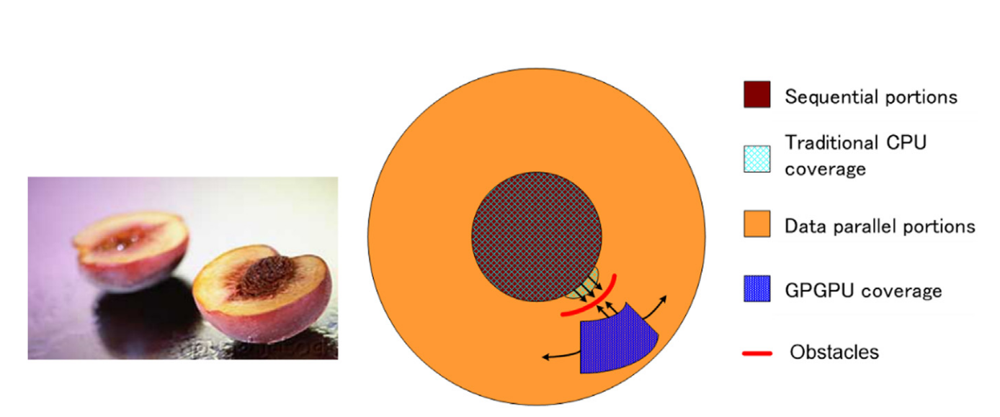

# 3. Tăng tốc các ứng dụng thực tế

Chúng ta có thể mong đợi mức độ tăng tốc bao nhiêu khi song song hóa một ứng dụng? Định nghĩa về tăng tốc của một ứng dụng do hệ thống tính toán A so với hệ thống tính toán B là tỷ số giữa thời gian thực thi ứng dụng trong hệ thống B trên thời gian thực thi cùng ứng dụng đó trong hệ thống A. Ví dụ, nếu một ứng dụng mất 10 giây để thực thi trong hệ thống A nhưng mất 200 giây để thực thi trong Hệ thống B, thì tăng tốc do hệ thống A thực thi so với hệ thống B sẽ là 200/10=20, được gọi là tăng tốc 20 lần (20x).

Tốc độ tăng tốc mà một hệ thống tính toán song song có thể đạt được so với một hệ thống tính toán tuần tự phụ thuộc vào phần ứng dụng có thể được song song hóa. Ví dụ, nếu tỷ lệ phần trăm thời gian dành cho phần có thể được song song hóa là 30%, thì tốc độ tăng tốc 100x của phần song song sẽ giảm thời gian thực thi tổng thể của ứng dụng không quá 29,7%. Điều đó có nghĩa là tốc độ tăng tốc cho toàn bộ ứng dụng chỉ khoảng 1/(1 - 0,297) = 1,423. Trên thực tế, ngay cả một lượng tốc độ tăng tốc vô hạn trong phần song song cũng chỉ có thể giảm 30% thời gian thực thi, đạt được tốc độ tăng tốc không quá 1,433. Thực tế là mức độ tăng tốc mà người ta có thể đạt được thông qua thực thi song song có thể bị hạn chế nghiêm trọng bởi phần có thể song song hóa của ứng dụng được gọi là Định luật Amdahl ([Amdahl, 2013](#amdahl-gm-2013-computer-architecture-and-amdahls-law-computer-46-12-38-46httpswwwresearchgatenetpublication260711393_computer_architecture_and_amdahls_law)). Mặt khác, nếu 99% thời gian thực thi nằm trong phần song song, tốc độ tăng tốc 100x của phần song song sẽ giảm thời gian thực thi ứng dụng xuống còn 1,99% thời gian ban đầu. Điều này mang lại cho toàn bộ ứng dụng tốc độ tăng tốc 50x. Do đó, điều rất quan trọng là một ứng dụng có phần lớn thời gian thực thi nằm trong phần song song để bộ xử lý song song lớn có thể tăng tốc hiệu quả quá trình thực thi của nó.

Các nhà nghiên cứu đã đạt được tốc độ tăng hơn 100x lần đối với một số ứng dụng. Tuy nhiên, điều này thường chỉ đạt được sau khi tối ưu hóa và tinh chỉnh mở rộng sau khi các thuật toán đã được nâng cấp sao cho hơn 99,9% công việc của ứng dụng nằm trong phần song song.

Một yếu tố quan trọng khác ảnh hưởng đến mức độ tăng tốc có thể đạt được cho các ứng dụng là tốc độ truy cập và ghi dữ liệu từ và vào bộ nhớ. Trong thực tế, việc song song hóa đơn giản các ứng dụng thường làm bão hòa băng thông bộ nhớ (DRAM), dẫn đến chỉ khoảng 10x lần tăng tốc. Mẹo ở đây là tìm cách khắc phục các hạn chế về băng thông bộ nhớ, điều này liên quan đến việc thực hiện một trong nhiều phép biến đổi để sử dụng bộ nhớ tích hợp chuyên dụng của GPU nhằm giảm đáng kể số lần truy cập vào DRAM. Tuy nhiên, người ta cần phải tối ưu hóa thêm mã để khắc phục các hạn chế như dung lượng bộ nhớ tích hợp hạn chế. Một mục tiêu quan trọng của cuốn sách này là giúp người đọc hiểu đầy đủ các tối ưu hóa này và trở nên thành thạo trong việc sử dụng chúng.

Hãy nhớ rằng mức độ tăng tốc đạt được so với việc thực thi trên CPU đơn nhân cũng phản ánh tính phù hợp của CPU với ứng dụng. Trong một số ứng dụng, CPU hoạt động rất tốt, khiến việc tăng tốc hiệu năng bằng GPU trở nên khó khăn hơn. Hầu hết các ứng dụng đều có những phần có thể được thực thi tốt hơn nhiều bởi CPU. Người ta phải cho CPU một cơ hội công bằng để thực hiện và đảm bảo rằng mã được viết sao cho GPU bổ sung cho việc thực thi của CPU, do đó khai thác đúng cách khả năng tính toán song song dị thể của hệ thống CPU/GPU kết hợp. Tính đến ngày nay, các hệ thống máy tính thị trường đại trà kết hợp CPU đa nhân và GPU đa nhân đã mang khả năng tính toán teraflop đến máy tính xách tay và khả năng tính toán exaflop đến các cụm máy tính.

Hình 1.2 minh họa các phần chính của một ứng dụng điển hình. Phần lớn mã của một ứng dụng thực tế có xu hướng tuần tự. Các phần tuần tự này được minh họa như vùng “hạt” của quả đào; cố gắng áp dụng các kỹ thuật tính toán song song vào các phần này giống như cắn vào hạt đào - không phải là cảm giác tốt! Các phần này rất khó song song hóa. CPU có xu hướng hoạt động rất tốt trên các phần này. Tin tốt là mặc dù các phần này có thể chiếm một phần lớn mã, nhưng chúng thường chỉ chiếm một phần nhỏ thời gian thực thi của siêu ứng dụng.

<figure>
    
    <figcaption>Hình 1.2 Phạm vi bao phủ các phần ứng dụng tuần tự và song song. Các phần tuần tự và các phần bao phủ của CPU truyền thống (lõi đơn) chồng chéo lên nhau. Kỹ thuật GPGPU trước đây cung cấp khả năng bao phủ rất hạn chế đối với các phần song song dữ liệu, vì nó bị giới hạn ở các phép tính có thể được định dạng thành việc vẽ điểm ảnh. Những trở ngại đề cập đến các hạn chế về năng lượng khiến việc mở rộng CPU lõi đơn để bao phủ nhiều phần song song dữ liệu hơn trở nên khó khăn.
</figcaption>
</figure>

Sau đó là những phần mà chúng ta gọi là phần “thịt quả đào”. Những phần này dễ song song hóa, cũng như một số ứng dụng đồ họa ban đầu. Lập trình song song trong các hệ thống điện toán dị cấu trúc có thể cải thiện đáng kể tốc độ của các ứng dụng này. Như minh họa trong Hình 1.2, các giao diện lập trình GPGPU ban đầu chỉ bao phủ một phần nhỏ của phần thịt quả đào, tương tự như một phần nhỏ của các ứng dụng thú vị nhất. Như chúng ta sẽ thấy, giao diện lập trình CUDA được thiết kế để bao phủ một phần lớn hơn nhiều của phần thịt quả đào trong các ứng dụng thú vị. Các mô hình lập trình song song và phần cứng cơ sở của chúng vẫn đang phát triển nhanh chóng để cho phép song song hóa hiệu quả các phần lớn hơn nữa của ứng dụng.

## References

#### [Amdahl, G.M., 2013. Computer architecture and amdahl’s law. Computer 46 (12), 38 46.]https://www.researchgate.net/publication/260711393_Computer_Architecture_and_Amdahl's_Law
