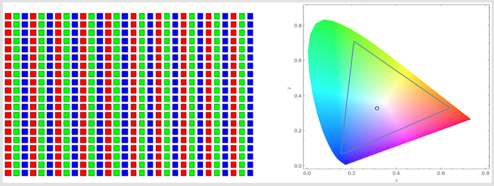
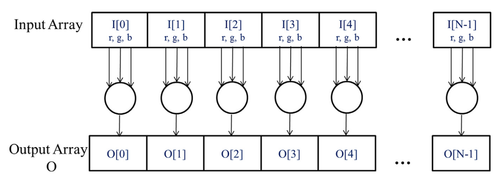

# 1. Dữ liệu song song

Khi các ứng dụng phần mềm hiện đại chạy chậm, vấn đề thường là dữ liệu—quá nhiều dữ liệu để xử lý. Các ứng dụng xử lý ảnh thao tác với các hình ảnh hoặc video với hàng triệu đến hàng nghìn tỷ pixel. Các ứng dụng khoa học mô hình hóa động lực chất lưu bằng hàng tỷ điểm lưới. Các ứng dụng động lực học phân tử phải mô phỏng tương tác giữa hàng nghìn đến hàng tỷ nguyên tử. Lịch trình hàng không giải quyết hàng nghìn chuyến bay, phi hành đoàn và cửa sân bay. Hầu hết các pixel, hạt, điểm lưới, tương tác, chuyến bay, v.v. này thường có thể được xử lý độc lập với nhau. Ví dụ, trong xử lý ảnh, việc chuyển đổi một pixel màu sang thang độ xám chỉ cần dữ liệu của pixel đó. Làm mờ một hình ảnh tính trung bình màu của mỗi pixel với màu của các pixel lân cận, chỉ cần dữ liệu của vùng lân cận nhỏ đó của các pixel. Ngay cả một hoạt động có vẻ toàn cục, chẳng hạn như tìm độ sáng trung bình của tất cả các pixel trong một hình ảnh, có thể được chia nhỏ thành nhiều phép tính nhỏ hơn có thể được thực hiện độc lập. Việc đánh giá độc lập các phần dữ liệu khác nhau như vậy là cơ sở của song song dữ liệu. Viết mã song song dữ liệu bao gồm (tái) tổ chức phép tính xung quanh dữ liệu sao cho chúng ta có thể thực hiện các phép tính độc lập thu được song song để hoàn thành công việc tổng thể nhanh hơn—thường nhanh hơn nhiều.

Hãy minh họa khái niệm song song dữ liệu với ví dụ chuyển đổi ảnh màu sang ảnh đen trắng. Hình 2.1 cho thấy một ảnh màu (bên trái) bao gồm nhiều điểm ảnh, mỗi điểm ảnh chứa một giá trị phân số đỏ, xanh lá và xanh dương (r, g, b) biến thiên từ 0 (đen) đến 1 (cường độ đầy đủ).

To convert the color image (left side of Fig. 2.1) to a grayscale image (right side), we compute the luminance value L for each pixel by applying the following weighted sum formula:

$$L = r*0.299 + g*0.587 + b*0.114$$

<figure>
    
    <figcaption>Hình 2.1 Chuyển đổi ảnh màu sang ảnh thang độ xám.
</figcaption>
</figure>

> **Biểu diễn ảnh màu RGB**  
> Trong biểu diễn RGB, mỗi điểm ảnh trong một hình ảnh được lưu trữ dưới dạng một bộ ba giá trị (r, g, b). Định dạng của một hàng ảnh là (r g b) (r g b) . . . (r g b), như minh họa trong hình ảnh khái niệm sau. Mỗi bộ ba chỉ định một hỗn hợp của màu đỏ (R), màu lục (G) và màu lam (B). Có nghĩa là, đối với mỗi điểm ảnh, các giá trị r, g và b thể hiện cường độ (0 là tối và 1 là cường độ đầy đủ) của các nguồn sáng màu đỏ, màu lục và màu lam khi điểm ảnh được hiển thị.  
>   
> Các hỗn hợp thực tế được phép của ba màu này khác nhau tùy thuộc vào không gian màu được chỉ định trong ngành. Ở đây, các tổ hợp hợp lệ của ba màu trong không gian màu AdobeRGBt được hiển thị bên trong tam giác. Tọa độ đứng (giá trị y) và tọa độ nằm ngang (giá trị x) của mỗi hỗn hợp cho thấy phần trăm cường độ điểm ảnh nên là G và R. Phần còn lại (1-y-x) của cường độ điểm ảnh nên được gán cho B. Để hiển thị hình ảnh, các giá trị r, g, b của mỗi điểm ảnh được sử dụng để tính toán cả cường độ tổng thể (độ sáng) của điểm ảnh cũng như các hệ số hỗn hợp (x, y, 1-y-x).

Nếu coi dữ liệu vào là một ảnh được tổ chức thành một mảng $I$ gồm các giá trị RGB và dữ liệu ra là một mảng $O$ tương ứng gồm các giá trị độ sáng, ta thu được cấu trúc tính toán đơn giản như thể hiện trong Hình 2.2. Ví dụ, $O[0]$ được tạo ra bằng cách tính tổng trọng số của các giá trị RGB trong $I[0]$ theo công thức ở trên; $O[1]$ được tạo ra bằng cách tính tổng trọng số của các giá trị RGB trong $I[1]$; $O[2]$ được tạo ra bằng cách tính tổng trọng số của các giá trị RGB trong $I[2]$; và cứ tiếp tục như vậy. Không có phép tính nào trên từng điểm ảnh phụ thuộc vào nhau. Tất cả chúng đều có thể được thực hiện độc lập. Rõ ràng, việc chuyển đổi màu sang thang độ xám thể hiện một lượng lớn song song dữ liệu. Tất nhiên, song song dữ liệu trong các ứng dụng hoàn chỉnh có thể phức tạp hơn, và phần lớn cuốn sách này dành để dạy tư duy song song cần thiết để tìm và khai thác song song dữ liệu.

<figure>
    
    <figcaption>Hình 2.2 Song song hóa dữ liệu trong chuyển đổi ảnh sang ảnh thang độ xám. Các điểm ảnh có thể được tính toán độc lập với nhau.
</figcaption>
</figure>

> **Tác vụ song song vs. Dữ liệu song song**  
> Song song dữ liệu không phải là loại song song duy nhất được sử dụng trong lập trình song song. Song song tác vụ cũng đã được sử dụng rộng rãi trong lập trình song song. Song song tác vụ thường được thể hiện thông qua việc phân tách tác vụ của các ứng dụng. Ví dụ, một ứng dụng đơn giản có thể cần thực hiện phép cộng vectơ và phép nhân ma trận-vectơ. Mỗi phép toán này sẽ là một tác vụ. Song song tác vụ tồn tại nếu hai tác vụ có thể được thực hiện độc lập. I/O và truyền dữ liệu cũng là những nguồn tác vụ phổ biến.  
> Trong các ứng dụng lớn, thường có số lượng lớn các tác vụ độc lập và do đó có lượng song song tác vụ lớn hơn. Ví dụ, trong một trình mô phỏng động lực học phân tử, danh sách các tác vụ tự nhiên bao gồm lực rung, lực quay, xác định lân cận cho lực không liên kết, lực không liên kết, vận tốc và vị trí, và các thuộc tính vật lý khác dựa trên vận tốc và vị trí.  
> Nói chung, song song dữ liệu là nguồn chính cho khả năng mở rộng của các chương trình song song. Với các tập dữ liệu lớn, người ta thường có thể tìm thấy sự song song dữ liệu dồi dào để có thể sử dụng các bộ xử lý song song cực lớn và cho phép hiệu suất ứng dụng tăng lên với mỗi thế hệ phần cứng có nhiều tài nguyên thực thi hơn. Tuy nhiên, song song tác vụ cũng có thể đóng một vai trò quan trọng trong việc đạt được các mục tiêu hiệu suất. Chúng ta sẽ đề cập đến song song tác vụ sau khi giới thiệu luồng.
