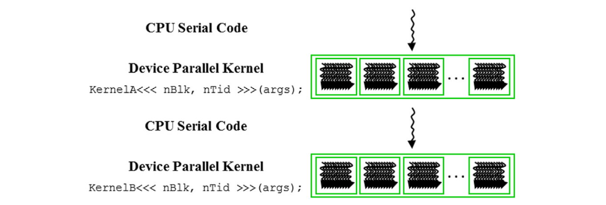

# 2. Cấu trúc chương trình CUDA C

Chúng ta đã sẵn sàng để học cách viết một chương trình CUDA C nhằm khai thác song song dữ liệu để thực thi nhanh hơn. CUDA C mở rộng ngôn ngữ lập trình ANSI C phổ biến với cú pháp và các hàm thư viện mới tối thiểu để cho phép lập trình viên nhắm mục tiêu vào các hệ thống tính toán dị nhất chứa cả lõi CPU và GPU song song mạnh mẽ. Như tên gọi, CUDA C được xây dựng trên nền tảng CUDA của NVIDIA. CUDA hiện là khuôn khổ trưởng thành nhất cho tính toán song song mạnh mẽ. Nó được sử dụng rộng rãi trong ngành công nghiệp điện toán hiệu năng cao, với các công cụ cần thiết như trình biên dịch, trình gỡ lỗi và trình phân tích hiệu năng có sẵn trên hầu hết các hệ điều hành phổ biến.

Cấu trúc của một chương trình CUDA C phản ánh sự đồng tồn tại của một máy chủ (CPU) và một hoặc nhiều thiết bị (GPU) trong máy tính. Mỗi tệp nguồn CUDA C có thể chứa hỗn hợp mã máy chủ và mã thiết bị. Theo mặc định, bất kỳ chương trình C truyền thống nào cũng là một chương trình CUDA chỉ chứa mã máy chủ. Người ta có thể thêm mã thiết bị vào bất kỳ tệp nguồn nào. Mã thiết bị được đánh dấu rõ ràng bằng các từ khóa đặc biệt của CUDA C. Mã thiết bị bao gồm các hàm, hay các kernel, mà mã của chúng được thực thi theo kiểu song song dữ liệu.

Việc thực thi một chương trình CUDA được minh họa trong Hình 2.3. Việc thực thi bắt đầu với mã phía host (mã tuần tự CPU). Khi một hàm kernel được gọi, một số lượng lớn các luồng được khởi chạy trên thiết bị để thực thi kernel. Tất cả các luồng được khởi chạy bởi một lời gọi kernel được gọi chung là một grid. Các luồng này là phương tiện chính của việc thực thi song song trên nền tảng CUDA. Hình 2.3 cho thấy việc thực thi của hai grid luồng. Chúng ta sẽ thảo luận về cách các grid này được tổ chức trong thời gian sớm. Khi tất cả các luồng của một grid hoàn thành việc thực thi, grid đó kết thúc, và việc thực thi tiếp tục trên host cho đến khi một grid khác được khởi chạy.

<figure>
    
    <figcaption>Hình 2.3 Quá trình thực thi một chương trình CUDA
</figcaption>
</figure>

Lưu ý rằng Hình 2.3 thể hiện một mô hình đơn giản hóa trong đó việc thực thi của CPU và việc thực thi của GPU không chồng chéo lên nhau. Nhiều ứng dụng điện toán dị cấu trúc quản lý việc thực thi chồng chéo của CPU và GPU để tận dụng cả CPU và GPU.

Khởi tạo lưới thường tạo ra nhiều luồng để khai thác song song dữ liệu. Trong ví dụ chuyển đổi ảnh màu sang ảnh xám, mỗi luồng có thể được sử dụng để tính toán một điểm ảnh của mảng đầu ra O. Trong trường hợp này, số lượng luồng cần được khởi tạo bởi lưới bằng với số lượng điểm ảnh trong ảnh. Đối với các ảnh lớn, một số lượng lớn luồng sẽ được tạo ra. Các lập trình viên CUDA có thể giả định rằng các luồng này chỉ mất rất ít chu kỳ xung nhịp để tạo và lập lịch, nhờ vào hỗ trợ phần cứng hiệu quả. Giả định này trái ngược với các luồng CPU truyền thống, thường mất hàng nghìn chu kỳ xung nhịp để tạo và lập lịch. Trong chương tiếp theo, chúng ta sẽ trình bày cách thực hiện chuyển đổi màu sang xám và các kernel làm mờ ảnh. Trong phần còn lại của chương này, chúng ta sẽ sử dụng phép cộng vector làm ví dụ minh họa để đơn giản hóa.

> **Threads (Luồng)**
> Threads là một cái nhìn đơn giản về cách bộ xử lý thực thi một chương trình tuần tự trong các máy tính hiện đại. Một luồng bao gồm mã của chương trình, điểm đang được thực thi trong mã, và các giá trị của biến và cấu trúc dữ liệu của nó. Việc thực thi một luồng là tuần tự theo quan điểm của người dùng. Người ta có thể sử dụng trình gỡ lỗi cấp nguồn để theo dõi tiến trình của một luồng bằng cách thực thi từng câu lệnh một, xem xét câu lệnh sẽ được thực thi tiếp theo và kiểm tra các giá trị của biến và cấu trúc dữ liệu khi quá trình thực thi diễn ra.  
> Các luồng đã được sử dụng trong lập trình trong nhiều năm. Nếu một lập trình viên muốn bắt đầu thực thi song song trong một ứng dụng, anh/cô ấy tạo và quản lý nhiều luồng bằng cách sử dụng thư viện luồng hoặc các ngôn ngữ đặc biệt. Trong CUDA, việc thực thi của mỗi luồng cũng là tuần tự. Một chương trình CUDA khởi tạo việc thực thi song song bằng cách gọi các hàm kernel, điều này khiến các cơ chế chạy nền khởi chạy một lưới các luồng xử lý các phần dữ liệu khác nhau song song.
